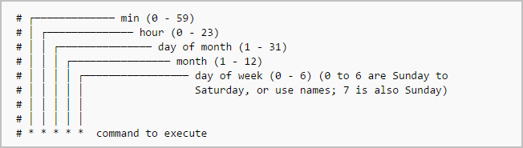

# Cron Jobs on MacOS

## Install homebrew 

https://brew.sh/

## Install python

`brew install python3`

## Grant access to cron to the full disk

Go to confidentiality and security < Full disk access

Add `/usr/sbin/cron` :

## Create the cron jobs

### Create a Cron Job

For this example, we will set up a cron job to run the hello_world.py script every minute.

### Time selection for cron job:



Edit the crontab with the command: `crontab -e`

Add the following line to run the script every minute:
`*/1 * * * * /usr/bin/python3 {path_to_project}/hello_world.py >> {path_to_project}/cron.log 2>&1`

### Verify Cron Jobs

To list all cron jobs: `crontab -l`

To delete all cron jobs: `crontab -r`

### Result

Here is an example output from the `output.txt` file:

```
14h 03m 00s HelloWorld
14h 04m 00s HelloWorld
14h 05m 00s HelloWorld
14h 06m 00s HelloWorld
14h 07m 00s HelloWorld
14h 08m 01s HelloWorld
14h 09m 00s HelloWorld
14h 10m 00s HelloWorld
14h 11m 00s HelloWorld
14h 12m 00s HelloWorld
14h 13m 00s HelloWorld
14h 14m 01s HelloWorld
14h 15m 00s HelloWorld
```


## Glossary 

https://ostechnix.com/a-beginners-guide-to-cron-jobs/